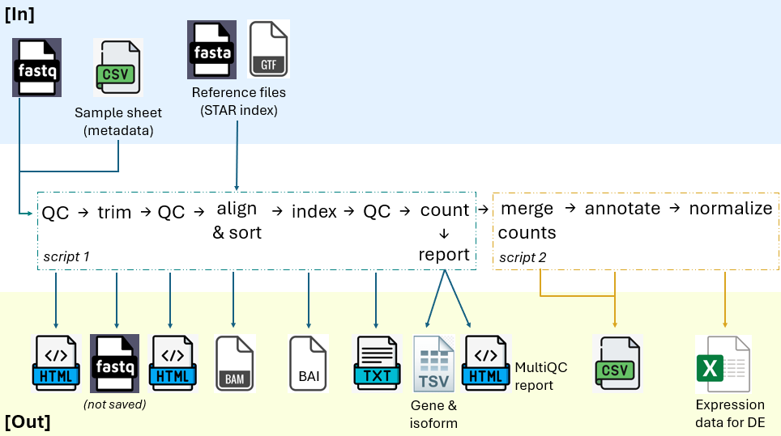
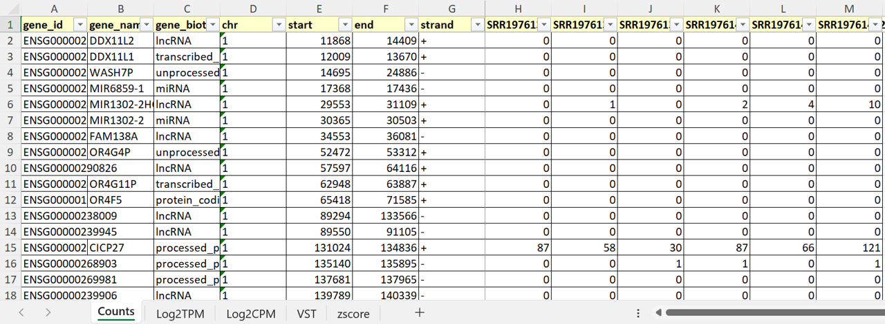
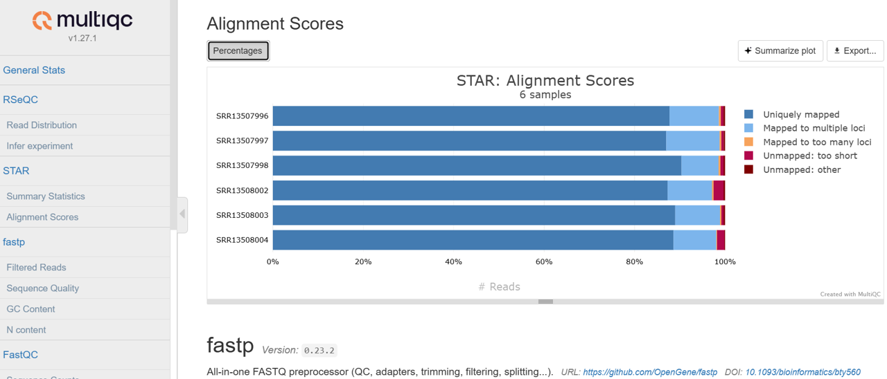

# Alignment Pipeline: RNA-Seq 

**Goal:** This pipeline aligns reads to a reference genome in order to quantify genes and transcripts from RNA-Seq data.

## Visual Summary

## Overview
Starting with fastq files and a sample sheet, this pipeline will do the following:

**Script 1 [Nextflow]:**
1. QC raw reads - [fastqc](https://www.bioinformatics.babraham.ac.uk/projects/fastqc/)
2. Trim them - [fastp](https://github.com/OpenGene/fastp?tab=readme-ov-file#all-options)
3. QC trimmed reads - [fastqc](https://www.bioinformatics.babraham.ac.uk/projects/fastqc/)
4. Align reads to a reference genome - [STAR](https://github.com/alexdobin/STAR/blob/master/doc/STARmanual.pdf)
5. QC the aligned bam files - [RSeQC](https://rseqc.sourceforge.net/)
6. Count genes and transcripts - [RSEM](https://github.com/deweylab/RSEM)
7. Create a final QC report - [MultiQC](https://docs.seqera.io/multiqc/modules/)

**Script 2 [R]:**
1. Perform a final merge of all samples
2. Add gene and transcript annotations
3. Normalize expression data in a few ways, such as VST, log2CPM, and z-score
4. **Note:** The final expression file can be used as input into a differential expression (DE) workflow

## Example File: Gene Expression Data

## Example File: MultiQC Report

## FAQ
1. Where can I find the fastq files and sample sheet that are used as inputs?
	- **[PublicStudy_GoldMiner](https://github.com/matthewonorato/PublicStudy_GoldMiner).** Right now this pipeline takes in publicly available RNA-Seq data with the metadata cleaned and formatted from `PublicStudy_GoldMiner`.
2. Where can I find the reference files that are also used as inputs?
	- **[Reference_Librarian](https://github.com/matthewonorato/Reference_Librarian).** Reference files, such as genomic FASTA and GTF files, can be easily obtained using `Reference_Librarian`.
3. What type of RNA-Seq data can this pipeline handle?
	- **Both single-end and paired-end data.** Using info from the sample sheet, the pipeline will utilize the appropriate commands and parameters for single-end or paired-end reads. 
4. Why are the trimmed FASTQ files not saved?
	- The main reason is to save on space. In addition, these files can be reconstructed from the saved BAM files if needed.
5. What's with all of the different normalizations?
	- Normalization is important account for technical variability, such as different read depths across samples, and to limit false positives and negatives. Use VST for QC (like PCA), TPM for within sample comparisons, and CPM+TMM for across sample comparisons (like DE). With that said, each normalization has it's strengths and weaknesses:
	    - **Counts** (input for normalization): Do not use directly, as counts are unnormalized
	    - **VST** (QC): Reduces the dependence of the variance on the mean
	    - **TPM** (within sample): Corrects for gene length (more reads for longer genes) and sequencing depth
	    - **CPM+TMM** (across samples): Corrects for both sequencing depth and RNA composition bias
	    - **z-score** (across samples): Removes the effect of outliers, usually highly expressed genes

## Tool Selection

| Software | Version | Usage | Rationale |
|:--------:|:--------:|:--------:|:--------:|
| FastQC   | 0.12.1   | Assess raw reads for base quality, GC content, adapter contamination, and more   | Gold-standard tool to QC sequencing data |
| fastp   | 0.23.2   | Remove adapter sequences and low quality bases, and filter out short reads after trimming   | fastp is faster than Trimmomatic and auto-detects adapters, while preserving Trimmomatic's high quality  |
| FastQC   | 0.12.1   | Verify trimming effectiveness, such as improved per-base quality scores and reduced adapter content   | Gold-standard tool to QC sequencing data   |
| STAR   | 2.7.11b   | Align RNA-Seq reads to a reference genome; optimized for gapped alignment across exon junctions   | Gold-standard aligner for RNA-Seq that performed well in this [comprehensive benchmarking study](https://www.nature.com/articles/s41598-020-76881-x)   |
| samtools     | 1.20   | Index BAM files for fast access | Gets the job done   |
| RSeQC   | 5.0.4   | Determine gene feature distribution and strandedness for each sample   | Both help to QC samples.  Note: strandedness is also determined before alignment using `salmon` in `PublicStudy_GoldMiner`.   |
| RSEM   | 1.3.3   | Quantify gene *and* transcript expression; handles reads that map to multiple genes or isoforms by assigning fractional counts   | For accurate gene and transcript counts. I'd like to eventually compare RSEM to [HTSeq Union](https://htseq.readthedocs.io/en/latest/tutorials/exon_example.html#tutorial-htseq).  |
| MultiQC   | 1.27.1   | Report all QC metrics across samples   | Gold-standard reporting tool  |
